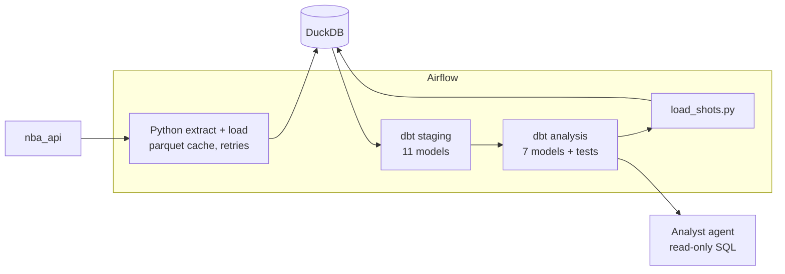
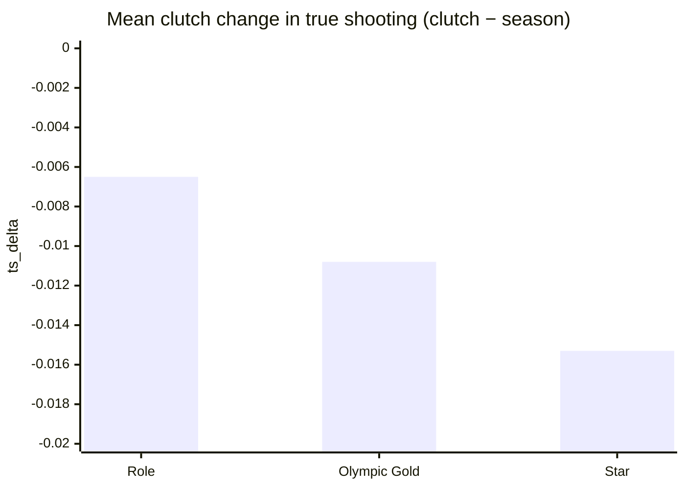
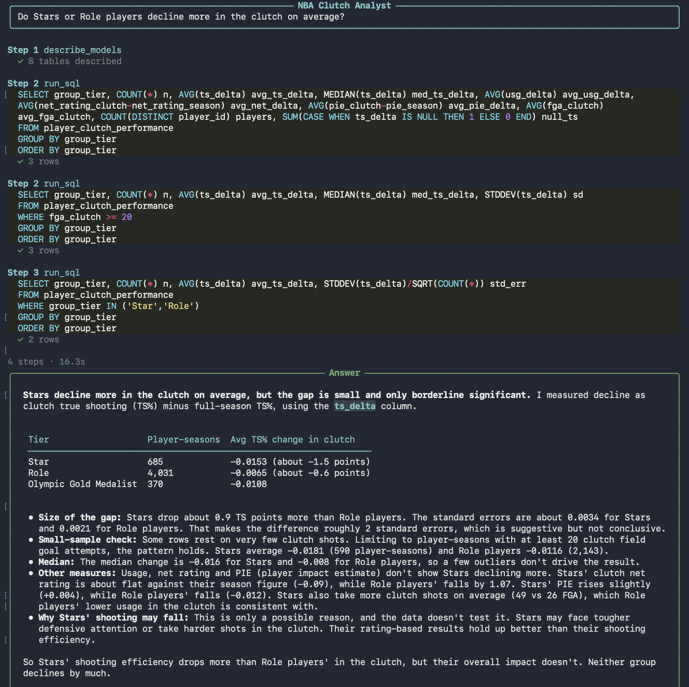

# 🏀 NBA Clutch Reputation Database


> [!IMPORTANT]
> **Stars decline the most in the clutch.** Across 5,086 player-seasons (2004-05 to 2025-26), every reputation tier shoots worse in the clutch than over the full season, and Stars drop the most: −1.5 points of true shooting vs. −0.65 for role players. Reputation gets them the ball, but it doesn't make the shots go in.

An ELT pipeline that extracts NBA player and team statistics via `nba_api`, loads them into DuckDB, and transforms them with dbt to analyze how players' clutch performance compares to their season-long performance and reputation tier — do "Stars" actually perform better in the clutch, or does reputation outpace results? An analyst agent sits on top, answering questions about the data in plain English with read-only SQL.

## Architecture



The pipeline follows a strict ELT pattern with three sequential stages:

1. **Extract + Load** (`pipeline/main.py`) — pulls raw data from 8 `nba_api` endpoints across every season from 2004-05 to 2025-26, caches responses as parquet, and loads them into DuckDB as raw tables. Failed API calls are retried with exponential backoff; anything still failing is written to a manifest in `pipeline/cached_data/failures/` and the run exits with an error, so incomplete data (like a player missing their awards, which would wrongly classify them as Role) never reaches dbt. Successful calls stay cached, so a rerun only re-fetches what failed.
2. **Transform** (`dbt build --exclude tag:shots`) — builds the staging layer and analysis models, and runs all data and unit tests, entirely in SQL. Shot models and their tests are tagged `shots` and skipped here, because the shots haven't been loaded yet.
3. **Shot extraction** (`pipeline/load_shots.py`, then a full `dbt build`) — pulls clutch shot-chart data, scoped to the ~5,086 player-seasons already qualifying in the `player_clutch_performance` dbt model (rather than every player-season in NBA history). Because this step queries a dbt model, it must run *after* stage 2, not alongside stage 1 — this is why it's a separate script rather than folded into `main.py`. A final full `dbt build` then builds and tests the shot models on the freshly loaded shots.

Raw tables store true, unrenamed API field names; a dedicated dbt staging layer (`models/staging/`) handles all renaming to friendly, analysis-ready column names — this logic previously lived in Python's load step and was moved into dbt so naming conventions are version-controlled, testable, and visible in the lineage graph.

All three stages are orchestrated by two Airflow DAGs, running in a local Docker Compose environment (CeleryExecutor, Postgres, Redis): `nba_clutch_pipeline` handles stages 1–2, then triggers `nba_clutch_shots` for stage 3 and the final dbt rebuild.

## Data Sources

All data comes from the unofficial `nba_api` Python package, covering Regular Season data from the 2004-05 season through 2025-26:

| Endpoint | Data |
|---|---|
| `LeagueDashPlayerStats` (Advanced) | Season-long advanced stats (ratings, efficiency, usage) |
| `LeagueDashPlayerStats` (Base) | Season-long basic box score stats |
| `LeagueDashPlayerClutch` (Advanced) | Clutch-situation advanced stats |
| `LeagueDashPlayerClutch` (Home/Road splits) | Clutch stats split by home vs. road games |
| `LeagueDashTeamStats` (Advanced) | Team defensive ratings, by season |
| Matchup/primary defender endpoints | Player-vs-player defensive matchup minutes |
| Awards endpoint | Career awards (used to classify reputation tier) |
| `ShotChartDetail` | Individual clutch shot attempts (official clutch definition), with location and opponent context |

## Repository Structure

```
data_eng_project/
    pipeline/
        extract/         — one module per data domain (stats, matchups, awards, shots, static)
            api.py       — shared retry-with-backoff and failure-manifest helpers
        load/            — save/load utilities, missing-player backfill logic
        main.py          — orchestrates the full raw EL run
        load_shots.py    — separate script for shot extraction (see Architecture)
        checks.py        — data validation helpers
        cached_data/     — per-call parquet cache, avoids re-hitting the API on reruns (gitignored)
    dbt/
        models/
            staging/     — 11 staging models, renaming raw columns to friendly names
            7 analysis models + team_abv_lookup
            sources.yml, schema.yml (data tests & descriptions), unit_tests.yml
        dbt_project.yml
        tests/           — singular data tests (e.g. shot counts vs. official clutch FGA)
    agent/
        analyst.py       — analyst agent: answers questions with read-only SQL (see Analyst Agent)
    airflow/
        Dockerfile                    — custom Airflow image with project dependencies
        requirements-dbt.txt          — dbt packages, installed into a separate venv in the image
        requirements.txt              — pipeline packages, installed with Airflow's constraints file
        .env.example                  — template for required secrets (copy to .env)
        docker-compose.yaml
    docs/
        agent-demo.png   — screenshot of the analyst agent
    scratch/
        nba_data_load.ipynb              — ad-hoc notebook for testing snippets
        findings_ts_delta_by_tier.sql    — query behind the Findings section below
    setup.sh             — one-command dependency install (Python + dbt packages)
    requirements.txt     — pinned Python dependencies
    nba_schema.sql       — full raw table DDL (idempotent, run on every main.py run)
    nba_clutch.duckdb    — the database itself, created by the pipeline (gitignored)
```

## Setup & Running

**Requirements:** Python 3.13, Docker Desktop (for Airflow). Python dependencies are pinned in `requirements.txt`. The analyst agent also needs an Anthropic API key (see Analyst Agent).

**Install dependencies:**
```bash
./setup.sh                   # creates .venv if no environment is active, installs Python + dbt packages
source .venv/bin/activate    # skip if you're using your own conda/venv
```

> [!TIP]
> **macOS + python.org Python:** if setup fails with `CERTIFICATE_VERIFY_FAILED`, run `"/Applications/Python 3.13/Install Certificates.command"` once, then rerun `./setup.sh`.

> [!NOTE]
> The database and parquet cache aren't in the repo, so a fresh clone must run the full pipeline once: about 51 minutes for `main.py` and 2h39m for `load_shots.py` (roughly 3.5 hours total), since every season is pulled from the API. Runtimes vary with NBA API responsiveness. Later runs read from the local cache and are much faster.

**Run manually**, in this exact order (each stage depends on the previous one completing):
```bash
python3 -u pipeline/main.py                                  # raw extract + load — ~51 min on a fresh run (empty cache)
cd dbt && dbt build --exclude tag:shots --profiles-dir .     # builds and tests everything except the shot models
cd .. && python3 -u pipeline/load_shots.py                   # shot extraction — ~2h39m on a fresh run; requires the build above
cd dbt && dbt build --profiles-dir . && cd ..                # full rebuild so shot models and their tests run on the loaded shots
```

**Run via Airflow** (recommended — handles the sequencing automatically):
```bash
cd airflow
cp .env.example .env              # then fill in AIRFLOW_UID and generate the three keys (commands are in the file)
docker compose build              # builds the custom image with project dependencies
docker compose up airflow-init    # one-time setup
docker compose up -d              # starts the full stack
```
Then trigger the `nba_clutch_pipeline` DAG from the UI at `localhost:8080` (default login: `airflow` / `airflow`). The pipeline is split into two DAGs. `nba_clutch_pipeline` runs `main.py → dbt deps → dbt build --exclude tag:shots`, then triggers `nba_clutch_shots`, which runs `load_shots.py → dbt build` so shot models are rebuilt and tested on the freshly loaded shots.

<details>
<summary><b>Why a custom Airflow image and a separate dbt venv?</b></summary>

Airflow runs on a custom image (`airflow/Dockerfile`). Pipeline packages (`airflow/requirements.txt`) are installed with Airflow's official constraints file, so they can't shift Airflow's own tested dependencies. dbt is installed in a separate virtual environment (`airflow/requirements-dbt.txt`, at `/home/airflow/dbt_venv`) because its dependencies conflict with Airflow's (for example, dbt-core requires `pathspec<1.1` while Airflow pins 1.1.1); the DAGs call dbt by that path. Versions are pinned identically to the root `requirements.txt`, so local and Airflow runs use the same code. Rebuild with `docker compose build` after changing any of these files. Secrets (fernet key, API secret key, JWT secret) are loaded from `airflow/.env`, which is gitignored; `airflow/.env.example` lists the required variables.

</details>

## dbt Models

A staging layer (11 models, one per raw table) handles all column renaming; the models below build on top of it via `ref()` rather than querying raw sources directly.

| Model | What it answers |
|---|---|
| `player_tier` | Classifies each player-season into a reputation tier — Role, Star, or Olympic Gold Medalist — using only awards won before that season |
| `player_clutch_performance` | One row per player-season with more than 100 season FGA and at least 15 clutch games, combining season-long and clutch stats, with `ts_delta` (clutch minus season true shooting) measuring the clutch change |
| `home_vs_road` | Compares clutch performance at home vs. on the road |
| `matchup_analysis` | One row per offensive player, defender, and season, with the defender's own season defensive rating alongside the offensive player's clutch `ts_delta` |
| `star_player_performance` | Subset of `player_clutch_performance` limited to Star/Olympic tier players, with each player's first award-winning season attached |
| `player_clutch_playmaking` | Adds season-long assist/rebound involvement alongside clutch scoring metrics |
| `shots_with_opponent` | Every clutch shot attempt joined to the shooter's opponent team and that opponent's season defensive rating |
| `team_abv_lookup` | Maps every team abbreviation used in any season, including historical ones (SEA, NJN, NOH, NOK), to its franchise `team_id` |

All models are tested for row-level uniqueness (via `dbt_utils.unique_combination_of_columns` or `unique`/`not_null` on a surrogate key) and, where relevant, accepted-value constraints on categorical fields. `stg_clutch_shots` is tested on its natural key (`game_id` + `game_event_id`) rather than only its sequence-generated `shot_id`, and `shots_with_opponent` is tested with `dbt_utils.equal_rowcount` against `stg_clutch_shots` to catch shots silently dropped by joins. A singular test (`tests/assert_shot_counts_match_clutch_fga.sql`) checks that each player-season's clutch shot count matches its official clutch field-goal attempts, so the shot and stats datasets can't drift onto different clutch definitions.

`player_tier`'s classification logic is covered by dbt unit tests (`unit_tests.yml`) using mocked award data. They check that an award only counts from the following season (no look-ahead), that a gold medal without a star-level NBA award stays Role since the tier reflects NBA recognition specifically, and that players with no awards are kept rather than dropped by the joins.

Model and column descriptions in `schema.yml` state each model's grain and the direction of every delta column. They're written for human readers and are also what the analyst agent reads to understand the data.

<details>
<summary><b>Materialization strategy: why one table and the rest views</b></summary>

All models build as views by default (set in `dbt_project.yml`). The one exception is `player_clutch_performance`, materialized as a table via a per-model `{{ config(materialized='table') }}` override, because it's referenced by `ref()` in five other models — `home_vs_road`, `matchup_analysis`, `player_clutch_playmaking`, `shots_with_opponent`, and `star_player_performance` — each of which would otherwise re-run its full join (season stats + clutch stats + `player_tier` + player names) independently on every build. Materializing it once means that join runs a single time and gets read, not recomputed, by each downstream model.

Staging models also have multiple consumers, but they're simple column-renaming selects, cheap enough to stay views. No other model combines an expensive join with multiple downstream consumers, so the rest stay views until there's an actual case for change — likely once the planned dashboard starts querying them directly and repeatedly.

</details>

## Findings: Does Clutch Reputation Match Clutch Results?

Using `player_clutch_performance` (see `group_tier` and `ts_delta` definitions
in the dbt Models table above), player-seasons were grouped by tier to compare
clutch vs. season shooting efficiency. The unit of analysis is the
player-*season*, not the unique player — a player appearing in 8 seasons
contributes 8 rows to their tier's numbers. Tiers only count awards won
*before* a given season, so a player's early seasons count as Role until he
has actually earned the reputation. Query: `scratch/findings_ts_delta_by_tier.sql`.



| Tier                  | N (player-seasons) | Mean ts_delta | Median ts_delta | Stddev ts_delta | Mean usg_delta |
|-----------------------|-------------------:|--------------:|----------------:|----------------:|---------------:|
| Role                  | 4,031              | -0.0065       | -0.008          | 0.135           | -0.0242        |
| Star                  | 685                | -0.0153       | -0.016          | 0.088           | +0.0019        |
| Olympic Gold Medalist | 370                | -0.0108       | -0.013          | 0.088           | +0.0136        |

**All three tiers decline in the clutch** — no group shoots better than its own
season average. There's no evidence here of a "clutch gene" that lifts
efficiency above baseline.

**Reputation doesn't protect clutch efficiency — Stars decline the most.** By
both mean and median, Stars show the largest drop (-0.015 / -0.016) and Role
players the smallest (-0.0065 / -0.008), with Olympic Gold Medalists in
between. The Star–Role gap is about 2.2 standard errors, suggestive rather than
conclusive; the Star–Olympic gap is well within noise.

**Usage tells the "how."** Role players' smaller drop comes with a real usage
pullback (-0.024): they take on less of the offense in the clutch. Stars keep
slightly *more* of the load (+0.002), and their efficiency falls the most —
reputation gets them the ball, but doesn't make the shots go in. Olympic Gold
Medalists increase usage the most (+0.014) while declining less than Stars.

**Removing look-ahead strengthened the result.** An earlier version labeled
every season of a player's career by his career awards, so 497 seasons from
before players earned their reputation were counted as Star or Olympic. With
those moved to Role, the Star decline grew from -0.0133 to -0.0153 (mean) and
the ranking became consistent across mean and median.

> [!NOTE]
> **Caveats:** clutch samples are smaller than season samples by construction (15+ clutch games vs. 100+ season field-goal attempts), so individual player-season values are noisy — part of why Role's spread (0.135) is much wider than Star's (0.088). Player-seasons also aren't independent, since the same player appears in many seasons, so the standard errors above are likely optimistic.

## Analyst Agent



`agent/analyst.py` answers questions about the data in plain English. It's a Claude model running in a loop with two tools: `describe_models`, which reads each analysis model's description and column descriptions from dbt's manifest along with the column types from DuckDB, and `run_sql`, which runs a query and returns the result as text. The agent decides which tool to call, reads the result, and repeats until it can answer. Each step and query is printed as it runs, so you can check how an answer was reached, not just what it says.

The pipeline itself stays deterministic: the agent never extracts, loads, or transforms data. It only reads the finished analysis models.

**Setup**
1. Create an API key in the Claude Console and add credits.
2. Set the key in your terminal, never in a file or the repo:
```bash
   read -s "ANTHROPIC_API_KEY?Paste key: "    # zsh; hides the key and keeps it out of shell history
   export ANTHROPIC_API_KEY
```
3. Make sure dbt's manifest exists: `cd dbt && dbt parse --profiles-dir . && cd ..`

**Usage** (from the project root)
```bash
python3 agent/analyst.py "Do Stars or Role players decline more in the clutch on average?"
python3 agent/analyst.py --verbose "Which Star player-seasons had the biggest clutch decline?"
```
`--verbose` also prints each tool's full output, which is useful when checking whether a wrong answer came from missing information or a misreading.

**Guardrails**
- DuckDB is opened with `read_only=True`, so writes are refused by the database itself, not just discouraged by the prompt.
- The agent only sees the analysis models, never staging or raw tables.
- The system prompt requires every number to come from a query result, and asks the agent to say so when the data can't answer.
- Query results are capped at 50 rows, and the loop stops after 10 steps.

> [!WARNING]
> Don't run the agent while `main.py`, `load_shots.py`, or a dbt build is writing. DuckDB allows one writer at a time, and the read-only connection will fail with a lock error.

The agent's answers are only as good as the descriptions in `dbt/models/schema.yml`. If it misreads a column or a model's grain, fix the description, rerun `dbt parse`, and ask again.

## Known Limitations & Deliberate Simplifications

> [!WARNING]
> These are known trade-offs, documented so the results can be read with the right level of confidence.

- **Clutch uses the NBA's official definition everywhere:** the last 5 minutes of the 4th quarter or overtime, with the score within 5 points. Both the clutch stats (`LeagueDashPlayerClutch`) and the clutch shots (`ShotChartDetail`) request this definition from the API, and a dbt test checks that every player-season's shot count equals its official clutch field-goal attempts. An earlier version filtered shots by time only, which ignored the score and captured about six minutes instead of five; for LeBron James in 2015-16, that produced 205 "clutch" shots where the official count was 92.
- **No minimum on clutch shot attempts.** A player-season qualifies with 15+ clutch games and 100+ season field-goal attempts, but some take very few clutch shots (as few as 7 among Stars), so the most extreme `ts_delta` values rest on tiny samples.
- **Season range is hardcoded** to 2004-05 through 2025-26.
- **Load strategy is full-reprocess**, not incrementally extracted. Stats tables are loaded with `INSERT OR REPLACE`, and the shots table is emptied and reloaded in a single transaction on every run (with a versioned shot cache), so stale shots can't linger. Every run re-checks all cached data rather than only pulling genuinely new records.
- **20 of 159,335 clutch shots** have no recorded shot location.
- **Current-season handling isn't implemented** — there's no logic to distinguish an in-progress season from a completed one, so a season fetched mid-year would be cached as if final.